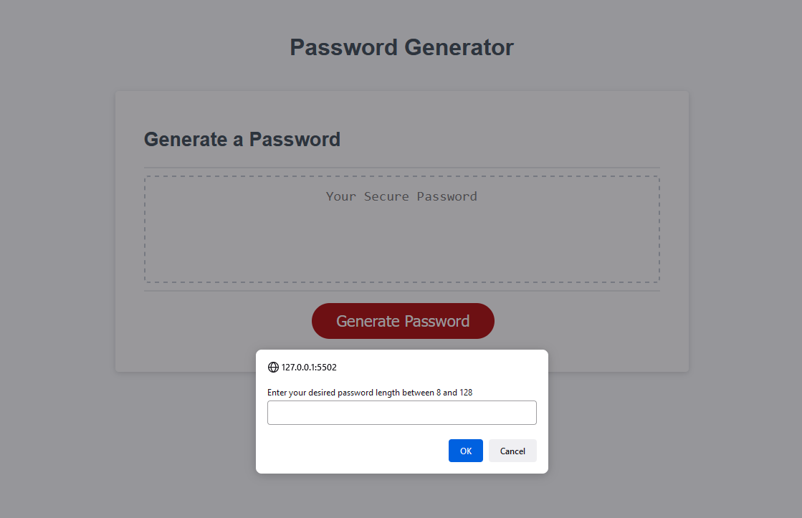

# password-generator

# Dev Portfolio
## Description

This applications generates a random password for the user based on several criteria.  The user has the option of requesting the length of the password as well as whether they would like lowercase, uppercase, numerical, or symbol characters.  As a bonus requirement, I ensure that the user will receive at least 2 characters from the option of lowercase, uppercase, numeric, and symbol.  HTML/CSS was pre-written for the course, I wrote the JS algorithms.

Tested for the following edge cases:
- Valid input (input is a number and 8 <= x <= 128)
- User provides nothing and clicks ok
- They enter a space and press ok
- They click cancel when prompted to enter data

## Table of Contents

- [Installation](#installation)
- [Usage](#usage)
- [Credits](#credits)
- [License](#license)

## Installation

Runs in the browser for mobile, tablet, laptop, and PC devices.

## Usage

You can visit the live application at - https://maximusdecimalusmeridius.github.io/password-generator

## Credits

N/A

## License

MIT License - Please refer to the LICENSE in the repo.